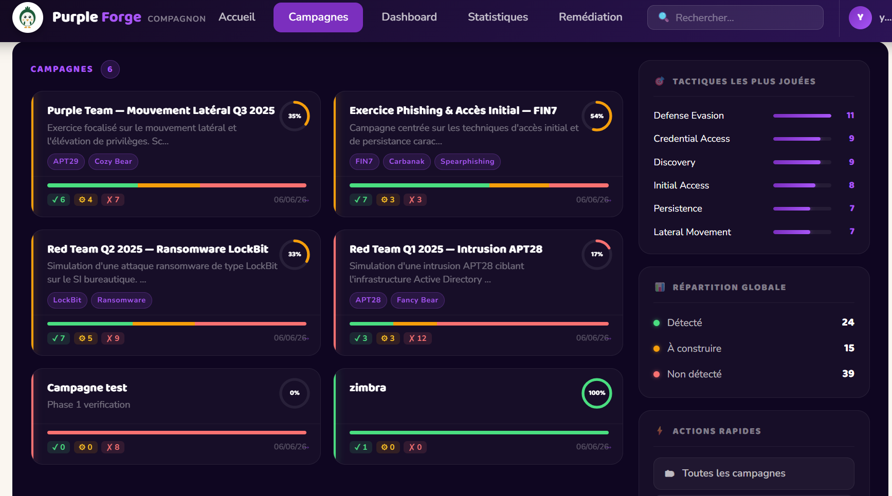
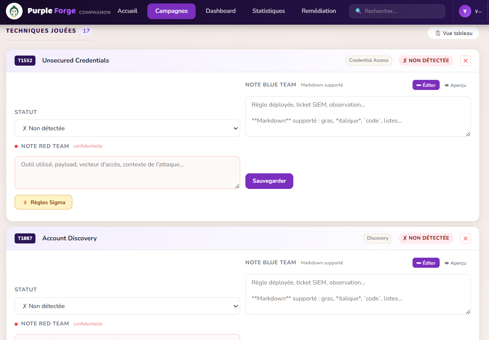
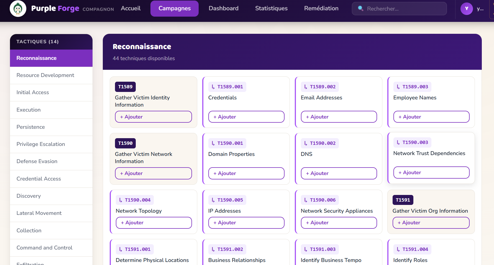
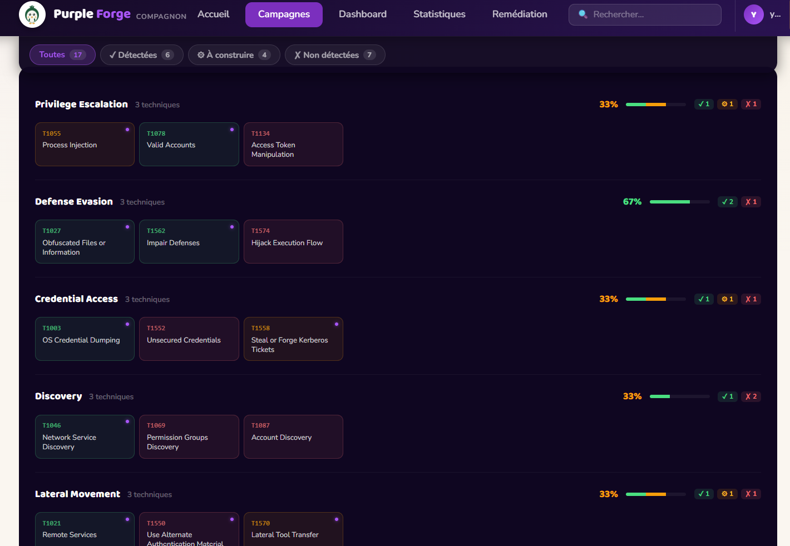
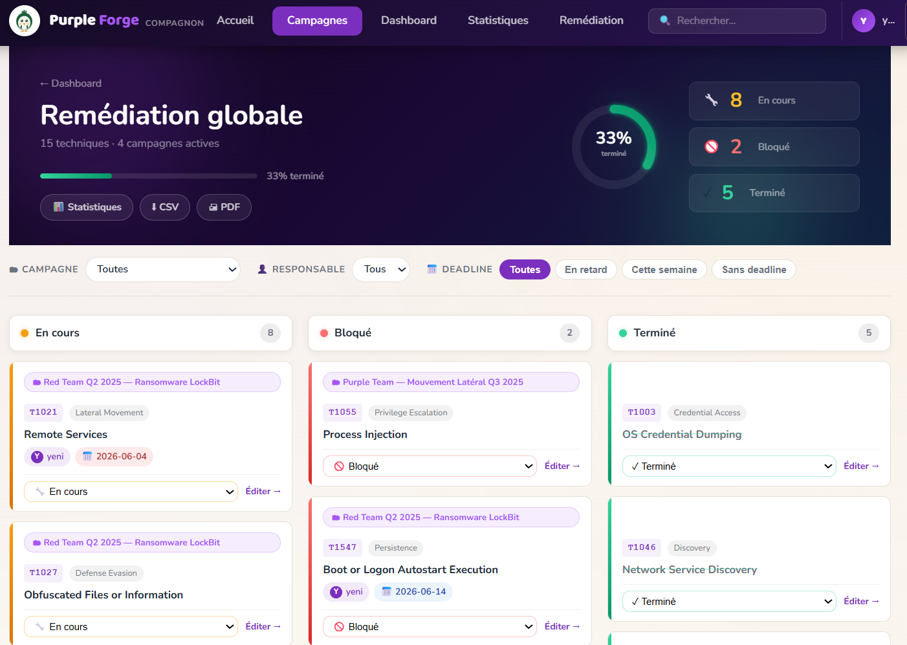

<div align="center">


# PurpleForge Compagnon

**Open-source purple teaming platform — MITRE ATT&CK coverage tracker**

Track adversary techniques, map detections, get Sigma rule suggestions, and measure your blue team coverage — all in one collaborative web app.

[](https://www.python.org/)
[](https://fastapi.tiangolo.com/)
[](https://htmx.org/)
[](tests/)
[](LICENSE)

*Interface en français — French UI · English README*

</div>

---

## What is PurpleForge?

PurpleForge is a **lightweight web platform for purple team exercises**. It bridges the gap between red team TTP execution and blue team detection by:

- Letting you **log every ATT&CK technique** played during an engagement
- Tracking **detection status** per technique (`Not detected` / `To build` / `Detected`)
- Automatically surfacing **Sigma detection rules** from SigmaHQ for each technique
- Generating an **ATT&CK Navigator export** to visualize coverage
- Producing **remediation boards** with ownership and deadlines
- Giving a **global coverage dashboard** across all campaigns

The value loop:

```
TTP played  →  Sigma rule suggested  →  Rule deployed & tested  →  Coverage updated
```

---

## Screenshots

| Campaigns — Tactical Ops Center | Campaign Detail |
|---|---|
|  |  |

| ATT&CK Matrix | Coverage View |
|---|---|
|  |  |

| Remediation Board | Global Dashboard |
|---|---|
|  |  |

---

## Features

### Campaign Management
- Create, edit, and delete purple team campaigns
- Tag campaigns (APT group, exercise type, date…)
- 10+ pre-built **APT templates** (APT28, APT29, Lazarus, Sandworm, Cozy Bear, and more)
- **Compare two campaigns** — delta of detection coverage
- **Import / Export** campaigns as PurpleForge JSON
- **PDF print view** per campaign

### ATT&CK Technique Tracking
- Browse the full **MITRE ATT&CK Enterprise matrix** (14 tactics, 200+ techniques)
- Add techniques to a campaign with one click
- Set detection status per technique:
  - 🔴 `Non détectée` — technique executed, nothing caught
  - 🟡 `À construire` — detection rule exists but not yet deployed
  - 🟢 `Détectée` — rule deployed and validated
- Add **blue team** and **red team notes** with Markdown support
- Paginated technique view for large campaigns

### Sigma Rule Suggestions
- For each ATT&CK technique, PurpleForge surfaces **up to 8 matching Sigma rules** from [SigmaHQ](https://github.com/SigmaHQ/sigma)
- Shows required log sources and full YAML content
- One click to copy the rule to your SIEM

### Coverage & Analytics
- **Per-campaign coverage page**: stacked bar (detected / to-build / not detected) by tactic
- **Global dashboard**: KPIs across all campaigns, overdue remediation alerts
- **Synthesis view**: one-row-per-campaign comparison table
- **Remediation board** (kanban-style): assign techniques to team members, set deadlines

### Exports
- 📊 **ATT&CK Navigator JSON** — drop into [attack-navigator](https://mitre-attack.github.io/attack-navigator/) for the heatmap view
- 📄 **CSV export** of techniques and remediation tasks
- 🖨️ **Print-friendly PDF** views

---

## Quick Start

### Prerequisites

- [Python 3.12+](https://www.python.org/downloads/)
- [Git](https://git-scm.com/)

### Local (Windows / macOS / Linux)

```bash
# 1. Clone the repo
git clone https://github.com/Yeni-raamia/purpleforge-compagnon.git
cd purpleforge-compagnon

# 2. Create and activate the virtual environment
python -m venv .venv

# Windows PowerShell
.\.venv\Scripts\Activate.ps1
# macOS / Linux
source .venv/bin/activate

# 3. Install dependencies
pip install -r requirements.txt

# 4. Start the server
uvicorn app.main:app --reload --port 8080
```

Open **http://127.0.0.1:8080** in your browser.

> **First launch:** The app automatically downloads two datasets on startup:
> - MITRE ATT&CK STIX data (~40 MB) — takes 30–60 s
> - SigmaHQ rule repository (~30 MB, 2 900+ rules) — takes 30–60 s
>
> These downloads happen **only once**; data is cached in `data/`. Subsequent starts are instant.

### Docker (one command)

```bash
docker compose up
```

Open **http://localhost:8080** — then `docker compose down` to stop.

> The SQLite database and cached data survive container restarts via Docker volumes.

### Default credentials

| Field | Value |
|---|---|
| Username | `admin` |
| Password | `admin` |

> Change the password immediately in the admin panel after first login.

---

## Usage Guide

### 1 — Create a campaign

**Campaigns** page → drawer panel on the right → fill in name, description, optional tags → **Créer**.

Or pick a template: **Modèles APT** → choose an APT group → the campaign is pre-loaded with the group's known techniques.

### 2 — Add techniques from the ATT&CK matrix

Inside a campaign → **Ouvrir la matrice ATT&CK** → navigate by tactic → click **+ Ajouter** on each technique played during the exercise.

### 3 — Qualify detections

On the campaign detail page, each technique has:
- A **status selector** — update without page reload (HTMX)
- A **red team note** field — what the attacker did, tools used
- A **blue team note** field — detection rule reference, SIEM ticket, comments
- A **Règles Sigma** button — surfaces matching detection rules from SigmaHQ

### 4 — Track remediation

**Remédiation** tab → assign a responsible person and a deadline per technique → board view shows progress by status.

Global `/remediation` board aggregates tasks across all campaigns.

### 5 — Export

- **Navigator JSON** → import into [ATT&CK Navigator](https://mitre-attack.github.io/attack-navigator/) for the colored matrix
- **CSV** → open in Excel / spreadsheet for reporting
- **Print** → browser `Ctrl+P` → clean print-optimized layout

---

## Architecture

```
purpleforge/
├── app/
│   ├── main.py                  # FastAPI entry point — routes registration, middleware
│   ├── database.py              # SQLite engine + idempotent migrations (ALTER TABLE)
│   ├── dependencies.py          # Auth middleware (require_user)
│   ├── models/
│   │   ├── user.py              # User model (auth)
│   │   ├── campaign.py          # Campaign model
│   │   └── technique.py         # TechniqueEntry (status, notes, remediation)
│   ├── routes/
│   │   ├── auth.py              # Login / logout
│   │   ├── campaigns.py         # CRUD campaigns + exports + per-campaign remediation
│   │   ├── techniques.py        # Status updates, notes, Sigma lookup
│   │   └── dashboard.py         # Global dashboard, remediation board, stats
│   ├── services/
│   │   ├── attack.py            # Download + parse MITRE ATT&CK STIX 2.1
│   │   ├── sigma.py             # Download + index SigmaHQ rules
│   │   ├── coverage.py          # Coverage statistics calculator
│   │   ├── dashboard.py         # Dashboard KPI aggregator
│   │   └── remediation_stats.py # Remediation analytics
│   ├── data/
│   │   └── apt_templates.py     # Pre-built APT campaign templates
│   ├── templates/               # Jinja2 HTML templates
│   │   ├── base.html            # Layout, nav, footer
│   │   ├── dashboard.html
│   │   ├── campaigns/
│   │   │   ├── list.html        # Tactical Ops Center — campaign list
│   │   │   ├── detail.html      # Campaign detail — technique cards
│   │   │   ├── matrix.html      # ATT&CK matrix browser
│   │   │   ├── coverage.html    # Coverage heatmap
│   │   │   ├── compare.html     # Two-campaign delta view
│   │   │   └── ...
│   │   └── partials/
│   │       └── technique_card.html  # HTMX-swappable technique card
│   └── static/
│       ├── style.css            # Single stylesheet (~7 700 lines, append-only)
│       └── favicon.svg          # Mascot bird favicon
├── data/                        # ATT&CK + Sigma cache (git-ignored)
├── tests/
│   ├── conftest.py              # In-memory SQLite fixtures + auth bypass
│   ├── test_smoke.py            # 4 sanity checks
│   └── test_routes.py           # 60 HTTP route tests (10 classes + E2E scenario)
├── Dockerfile
├── docker-compose.yml
├── requirements.txt
└── CONTRIBUTING.md
```

### Tech stack

| Layer | Technology |
|---|---|
| Web framework | [FastAPI](https://fastapi.tiangolo.com/) + [Uvicorn](https://www.uvicorn.org/) |
| HTML templating | [Jinja2](https://jinja.palletsprojects.com/) |
| Frontend interactivity | [HTMX 1.9](https://htmx.org/) — no JS framework |
| Database | [SQLite](https://www.sqlite.org/) via [SQLModel](https://sqlmodel.tiangolo.com/) |
| ATT&CK data | [MITRE ATT&CK STIX 2.1](https://github.com/mitre-attack/attack-stix-data) via `mitreattack-python` |
| Detection rules | [SigmaHQ](https://github.com/SigmaHQ/sigma) (~2 900 community rules) |
| Auth | Session cookie (`itsdangerous`) |

---

## Automated Data Downloads

On first startup, PurpleForge downloads and caches two external datasets:

| Source | Size | When |
|---|---|---|
| MITRE ATT&CK STIX (`attack-stix-data`, GitHub) | ~40 MB | Once — cached in `data/` |
| SigmaHQ rule repository (GitHub) | ~30 MB | Once — cached in `data/` |

To force a re-download: delete the corresponding files in `data/`. The `data/` folder is git-ignored to keep the repository lightweight.

---

## Tests

```bash
# Run all 64 tests
python -m pytest tests/ -v

# Quick smoke check only
python -m pytest tests/test_smoke.py -v
```

**Test architecture:**
- `conftest.py` — in-memory SQLite (`StaticPool`), fake admin user, HTMX test client
- `test_smoke.py` — 4 sanity checks (server starts, tables exist, home route responds)
- `test_routes.py` — 60 HTTP tests across 10 classes covering all routes + a full end-to-end scenario (campaign creation → technique add → status update → export)

All tests run in < 1 second with zero network calls.

---

## Roadmap

- [ ] **Wazuh integration** — live alert import mapped to ATT&CK techniques
- [ ] **Real-time search** — filter techniques by ID / name / tactic
- [ ] **Audit log** — full history of who changed what and when
- [ ] **Column sorting** — sortable tables in dense view
- [ ] **Time evolution graph** — detection coverage over time
- [ ] **In-app ATT&CK heatmap** — colored matrix without Navigator
- [ ] **Outbound webhooks** — Slack / Teams alerts on status change or overdue deadline
- [ ] **CSV import** — complement to existing JSON import
- [ ] **Multi-user** — campaign ownership and team collaboration

---

## Contributing

See [CONTRIBUTING.md](CONTRIBUTING.md) for guidelines on issues, branches, and pull requests.

---

## About the Suite Compagnon

PurpleForge is tool **#3** of the **Suite Outils Compagnon** — a family of open-source defensive CTI/OSINT tools built for SOC teams, sharing the same brand mascot (the little green bird 🐦) and design language:

| # | Tool | Role |
|---|---|---|
| 1 | **winCheck-Compagnon** | Windows asset inventory — PowerShell + HTML report |
| 2 | **Veille-Compagnon** | Data breach monitoring for .ga domains |
| 3 | **PurpleForge Compagnon** | Purple teaming platform — this repo |

---

## License

MIT — see [LICENSE](LICENSE).

---

<div align="center">
  Made with ❤️ for SOC teams · <a href="https://github.com/Yeni-raamia">@Yeni-raamia</a>
</div>
